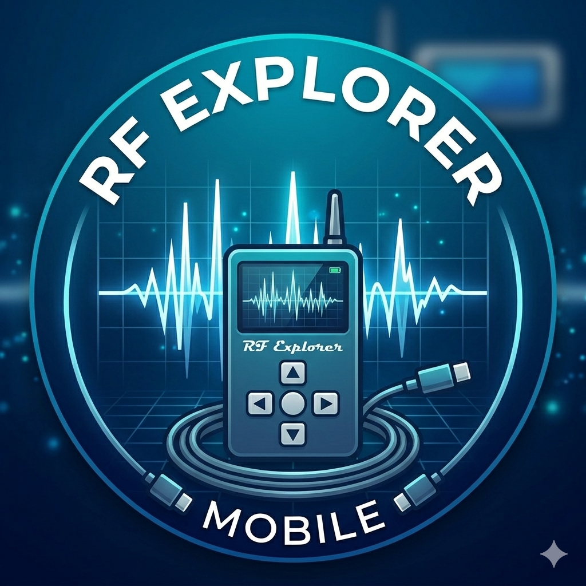
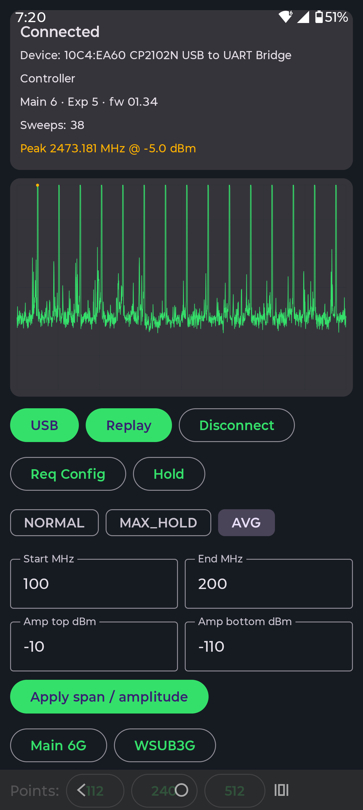
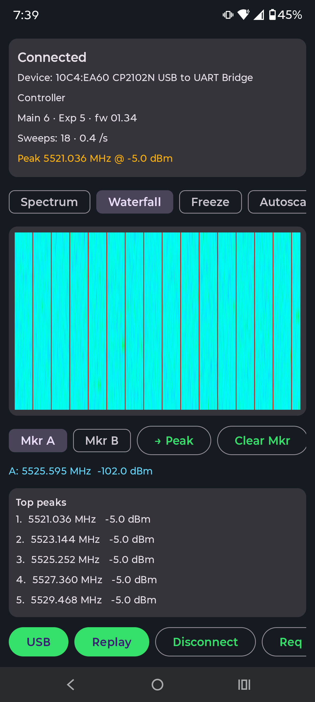

<div align="center">



# RF Explorer Mobile

**A native Android spectrum analyzer for the [RF Explorer 6G Combo](http://j3.rf-explorer.com/), over USB-OTG.**

[](https://github.com/evilgenius79/Rf-Explorer-Mobile/actions/workflows/ci.yml)
[](https://github.com/evilgenius79/Rf-Explorer-Mobile/releases/download/debug-latest/rfexplorer-debug.apk)

</div>

Plug an RF Explorer into your Android phone with a USB-OTG cable and watch live RF
spectrum on your screen — real-time trace, waterfall, peak tracking, markers, and CSV
logging. No internet, no accounts, no data collected.

<div align="center">

&nbsp;&nbsp;

</div>

---

## Features

**Visualization**
- Live **spectrum** trace with filled area, grid, and dBm / MHz axis labels
- **Waterfall** (spectrogram) — scrolling colour heatmap of recent sweeps
- **Autoscale** to fit the amplitude window to the live data
- **Auto peak** marker + **Top-peaks** table (plateau-aware, so one signal isn't listed five times)
- **Freeze** and **Clear**, plus a live **sweeps/sec** readout

**Measurement**
- **Two markers (A / B)** — tap the graph to place, snap to peak, with **Δ frequency / Δ dB** readout
- Trace math: **Normal / Max-Hold / Average**

**Tuning**
- **Start/Stop** or **Center/Span** entry
- One-tap **band presets** (433 / 915 MHz ISM, 2.4 GHz, 5 GHz) that **auto-switch the RF module**
- Amplitude window, sweep-point count (112 / 240 / 512), manual module switch (6G ↔ WSUB3G)
- Settings persist across launches

**Logging**
- **Record** sweeps and **export** RF-Explorer-style cumulative CSV
- **Share** the CSV straight to any app via the system share sheet

**Developer / no-hardware**
- **Replay mode** streams a bundled capture through the real parser, so the whole UI works with no device attached
- Raw-byte **hex debug** tail

---

## Requirements

- **Hardware:** RF Explorer **6G Combo** (6G mainboard + WSUB3G expansion). Other RF
  Explorer analyzer models using the CP210x bridge may work but are untested.
- **Cable:** USB-OTG (USB-C or micro-USB to the RF Explorer's mini-USB).
- **Phone:** Android **8.0+ (API 26)** with USB host support.

> The RF Explorer must be set to **500000 baud** and be in **Spectrum Analyzer** mode
> (actively sweeping), or no data will flow. (2400 baud is not supported by the app.)

## Install

1. Download the APK: **[rfexplorer-debug.apk](https://github.com/evilgenius79/Rf-Explorer-Mobile/releases/download/debug-latest/rfexplorer-debug.apk)**
   (or grab a tagged build from [Releases](https://github.com/evilgenius79/Rf-Explorer-Mobile/releases)).
2. On your phone, allow installing from unknown sources, then open the APK.
3. These are **debug-signed** builds for sideloading — not yet a Play Store release.

## Usage

1. On the RF Explorer: set the UART to **500 Kbps** and enter **Spectrum Analyzer** mode.
2. Connect it to the phone with the OTG cable.
3. Open the app, tap **USB**, and grant the permission dialog. The status bar shows the
   detected device (e.g. `Device: 10C4:EA60 …`) and goes **Connected**.
4. The trace animates. Use:
   - **Bands** for a quick jump (auto-switches WSUB3G ↔ 6G mainboard), or **Apply** with
     your own Start/Stop or Center/Span.
   - **Spectrum / Waterfall** to switch views; **Autoscale** for best contrast.
   - **Mkr A/B** + tap the graph to measure; **→ Peak** to snap a marker to the strongest signal.
   - **Record CSV** then **Export** / **Share**.

No hardware? Tap **Replay** to drive the UI from the bundled sample capture.

## Build from source

```bash
git clone https://github.com/evilgenius79/Rf-Explorer-Mobile.git
cd Rf-Explorer-Mobile

# Pure-Kotlin protocol unit tests (no Android SDK needed)
./gradlew :protocol:test

# Debug APK (requires the Android SDK)
./gradlew :app:assembleDebug
```

For a signed release build, copy `keystore.properties.example` to `keystore.properties`
and fill in your keystore details.

## Architecture

Three modules, dependency-inverted so the protocol core is pure and testable:

| Module | Type | Responsibility |
|---|---|---|
| `:protocol` | Pure Kotlin/JVM | `Command` builders + a binary-safe streaming `FrameParser`, sweep/CSV/calc logic. **No Android deps, fully unit-tested.** |
| `:transport` | Android library | CP210x USB-host link at 500000 8N1 (via [usb-serial-for-android](https://github.com/mik3y/usb-serial-for-android)), USB permission flow, file-replay source. |
| `:app` | Android (Compose) | Spectrum/waterfall views, controls, `ViewModel` wiring transport → parser → UI. |

Direction: `:app` → `:transport` → `:protocol`. The parser is a length-prefixed,
binary-safe state machine — it never splits on EOL, so amplitude bytes equal to
`0x0D`/`0x0A`/`$`/`#` decode correctly across USB read boundaries.

CI builds the app on GitHub runners and publishes a rolling debug APK on every push; a
`v*` tag cuts a versioned release.

## Privacy

No data is collected and the app has **no internet permission**. CSV exports stay on your
device until you share them. See [PRIVACY.md](PRIVACY.md).

## Roadmap

- Auto-reconnect on USB attach
- Save/share spectrum as an image
- Reference-level line and RBW/span readouts
- Foreground logging service (screen-off capture)
- Light theme; Play Store release with proper signing

## Acknowledgements

- [RF Explorer UART API](https://github.com/RFExplorer/RFExplorer-for-.NET/wiki/RF-Explorer-UART-API-interface-specification)
- [usb-serial-for-android](https://github.com/mik3y/usb-serial-for-android) by mik3y

## License

Not yet specified. Until a `LICENSE` file is added, all rights reserved by the repository owner.
